# Data Flow Architecture

## Request Flow Overview

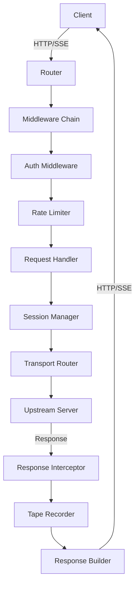

## Detailed Request Processing

### 1. Initial Request Reception
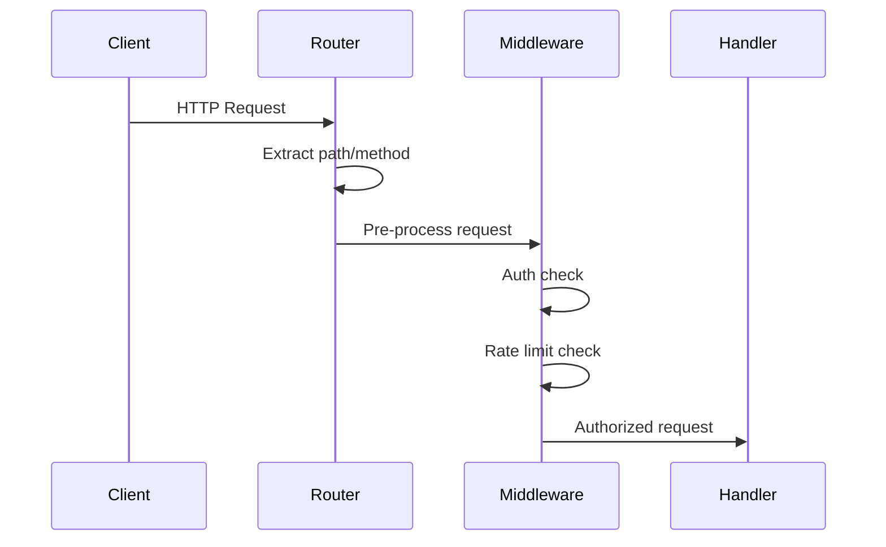

### 2. Session Management Flow
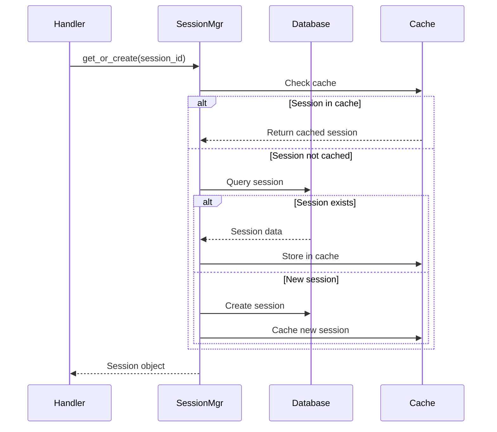

### 3. Transport Selection and Processing
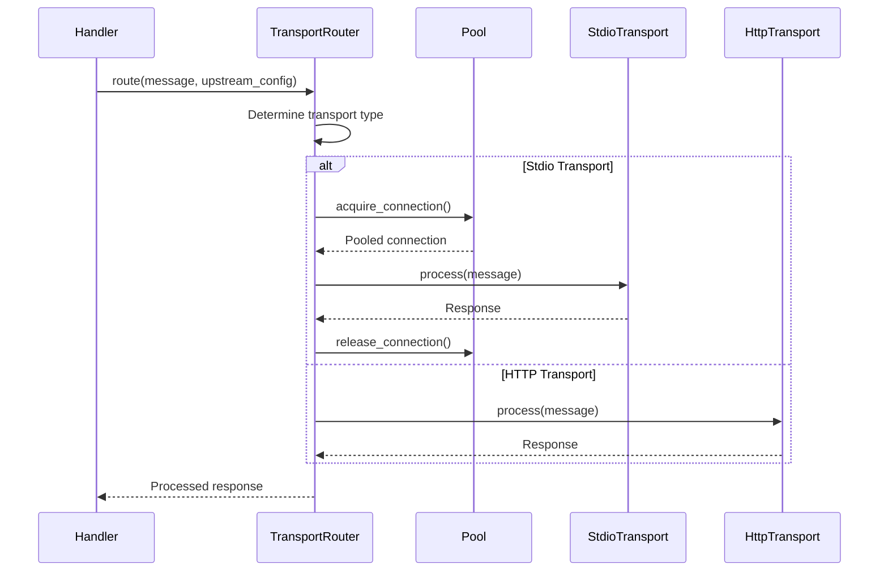

### 4. SSE Streaming Flow
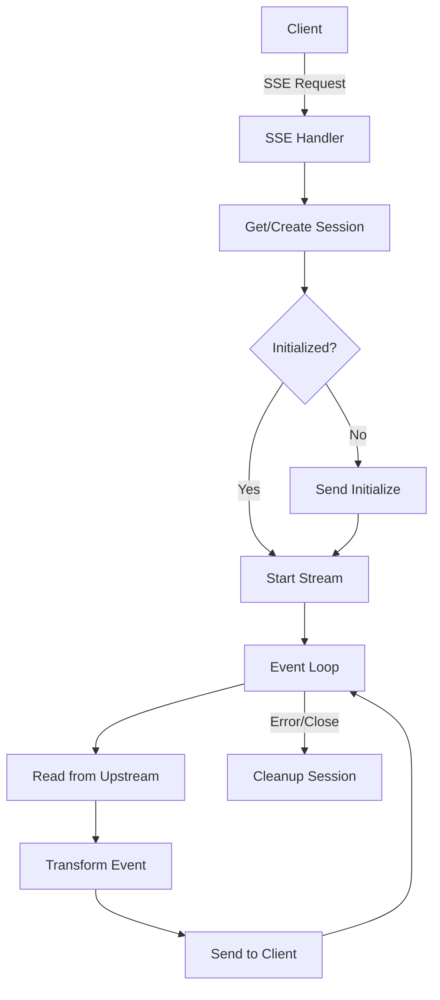

## State Management

### Application State Structure
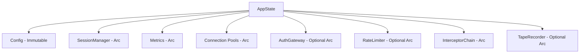

### Session State Lifecycle
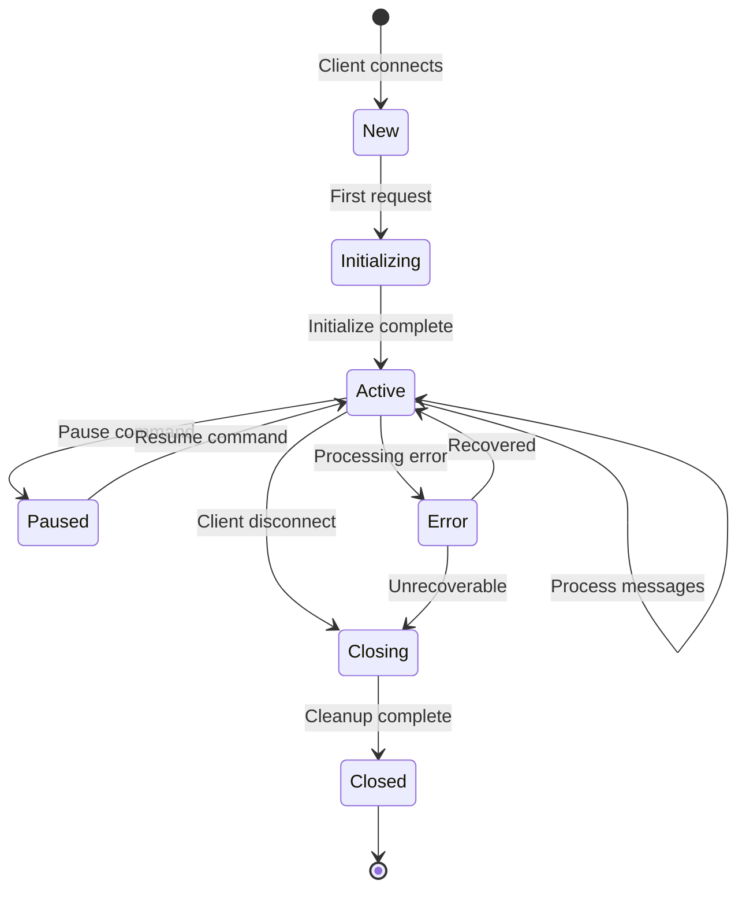

### Per-Request Context
```rust
struct RequestContext {
    // Immutable request data
    request_id: Uuid,
    method: Method,
    path: String,
    headers: HeaderMap,
    
    // Session reference
    session: Arc<Session>,
    
    // Shared app state
    state: Arc<AppState>,
    
    // Request-specific data
    start_time: Instant,
    auth_context: Option<AuthContext>,
    span: tracing::Span,
}
```

## Error Propagation

### Error Flow Paths
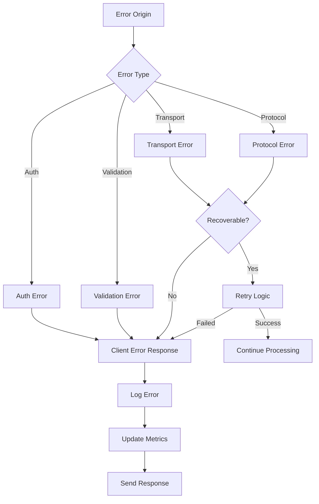

### Error Response Generation
```rust
// Error is caught at handler boundary
match process_request(req).await {
    Ok(response) => response,
    Err(e) => {
        // Log error with context
        error!(error = ?e, session_id = ?session_id, "Request failed");
        
        // Update metrics
        metrics.record_error(&e);
        
        // Generate appropriate client response
        match e {
            ReverseProxyError::Auth(_) => {
                Response::builder()
                    .status(StatusCode::UNAUTHORIZED)
                    .json(error_response("Authentication required"))
            }
            ReverseProxyError::RateLimit(_) => {
                Response::builder()
                    .status(StatusCode::TOO_MANY_REQUESTS)
                    .header("Retry-After", "60")
                    .json(error_response("Rate limit exceeded"))
            }
            _ => {
                Response::builder()
                    .status(StatusCode::INTERNAL_SERVER_ERROR)
                    .json(error_response("Internal server error"))
            }
        }
    }
}
```

## Message Interception Points

### Request Interception
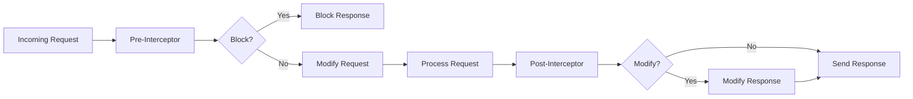

### Interception Context
```rust
struct InterceptContext {
    session_id: SessionId,
    direction: Direction,
    transport_type: TransportType,
    message_type: MessageType,
    timestamp: Instant,
    metadata: HashMap<String, Value>,
}

enum InterceptAction {
    Continue,           // Continue processing
    Modify(Value),      // Replace with modified message
    Block(Response),    // Block with response
    Pause,             // Pause processing
}
```

## Connection Pooling

### Pool Management Flow
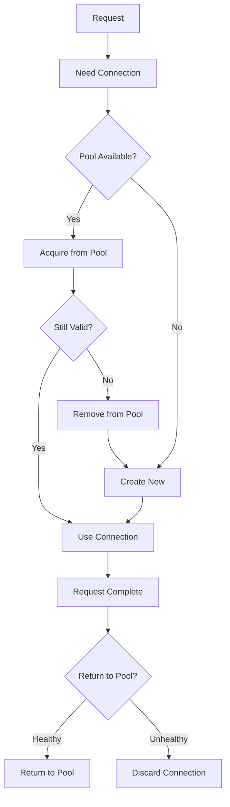

## Metrics Collection Points

### Metric Collection Flow
```mermaid
graph TD
    Start[Request Start] --> Timer[Start Timer]
    Timer --> Process[Process Request]
    
    Process --> Success{Success?}
    Success -->|Yes| RecordSuccess[Record Success Metrics]
    Success -->|No| RecordError[Record Error Metrics]
    
    RecordSuccess --> RecordTime[Record Duration]
    RecordError --> RecordTime
    RecordTime --> RecordSize[Record Response Size]
    RecordSize --> UpdateCounters[Update Counters]
    
    UpdateCounters --> Aggregate[Aggregate Stats]
    Aggregate --> Export[Export to Monitoring]
```

### Metrics Data Structure
```rust
struct MetricsData {
    // Counters
    requests_total: AtomicU64,
    requests_success: AtomicU64,
    requests_failed: AtomicU64,
    
    // Gauges
    active_sessions: AtomicU64,
    pool_connections: AtomicU64,
    
    // Histograms (protected by mutex)
    response_times: Mutex<Histogram>,
    response_sizes: Mutex<Histogram>,
    
    // Per-endpoint metrics
    endpoint_metrics: DashMap<String, EndpointMetrics>,
}
```

## Recording/Replay Flow

### Recording Process
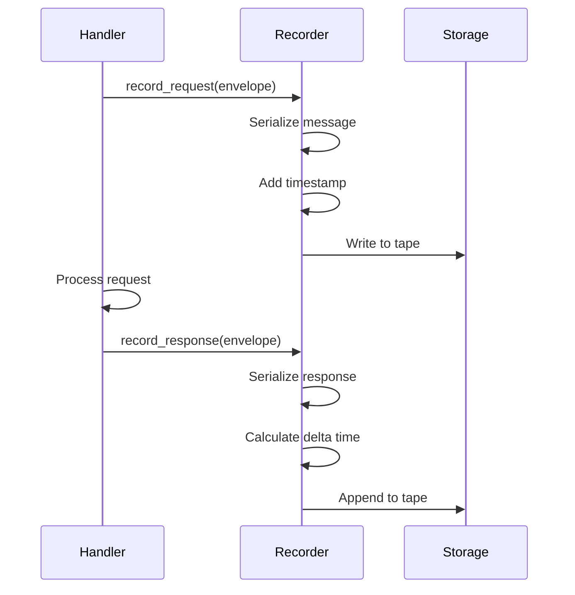

### Replay Process
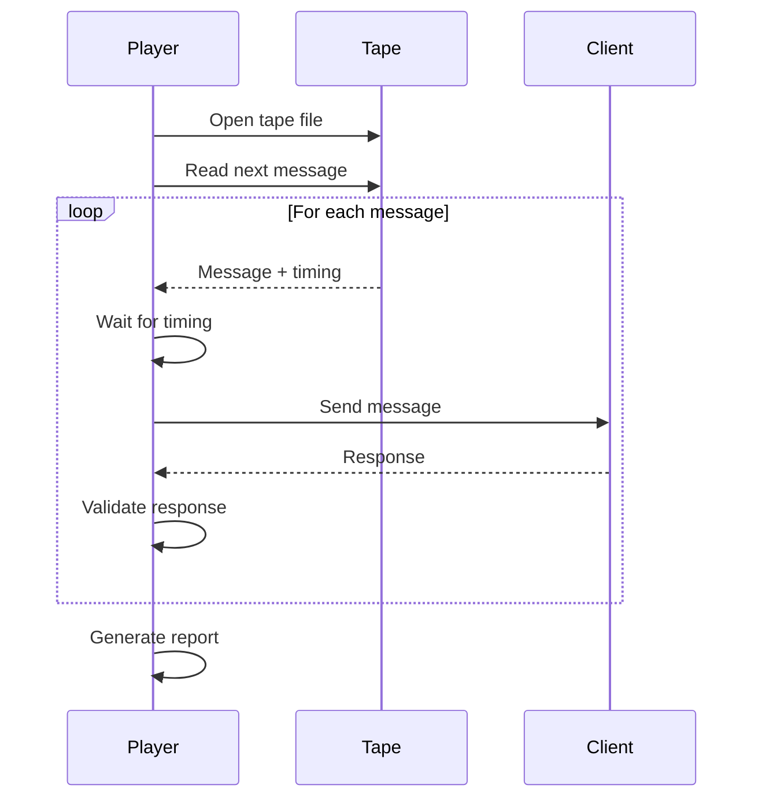

## Shutdown Sequence

### Graceful Shutdown Flow
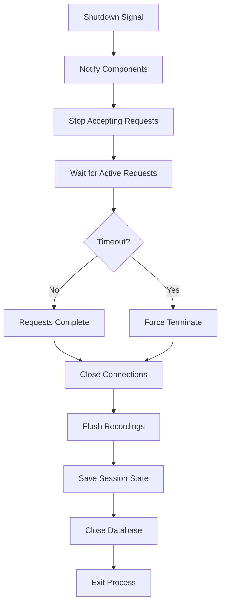

## Performance Considerations

### Critical Path Optimization
1. **Session Cache**: In-memory LRU cache reduces database queries
2. **Connection Pooling**: Reuse connections for stdio transports
3. **Buffer Pooling**: Reuse byte buffers for serialization
4. **Lazy Initialization**: Defer expensive operations until needed
5. **Async Processing**: Non-blocking I/O throughout

### Bottleneck Mitigation
```rust
// Example: Parallel upstream requests
let futures = upstreams.iter().map(|upstream| {
    async move {
        process_upstream(upstream).await
    }
});

let results = futures::future::join_all(futures).await;
```