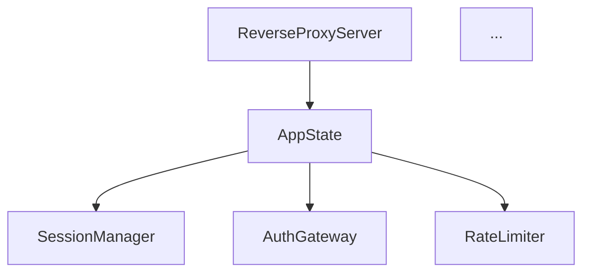

# Task A.1: Dependency Mapping

## Objective
Create a comprehensive dependency map showing how components in `legacy.rs` depend on each other and external modules.

## Context
Understanding dependencies is crucial for determining extraction order. We need to identify which components can be extracted first (leaf nodes) and which have complex interdependencies.

## Deliverables

### 1. Internal Dependency Graph
Create `analysis/internal-dependencies.md`:


### 2. External Dependency Matrix
Create `analysis/external-dependencies.md`:

| Component | External Deps | Can Extract? | Notes |
|-----------|--------------|--------------|-------|
| Config types | serde, std | Yes - Leaf | No dependencies |
| Server | tokio, axum | After config | Needs AppState |
| Handlers | All | Last | Heavy deps |

### 3. Extraction Order Plan
Document in `analysis/extraction-order.md`:
1. First wave (no dependencies)
2. Second wave (only first wave deps)
3. Third wave (complex dependencies)
4. Final cleanup

## Process

### Step 1: Map Struct Dependencies
For each major struct, identify:
- What it contains (fields)
- What it depends on (imports)
- Who depends on it (usage)

### Step 2: Map Function Dependencies
For key functions like `handle_mcp_request`:
- Parameters (what it needs)
- Return types (what it produces)
- Internal calls (what it uses)
- State access (shared data)

### Step 3: Identify Circular Dependencies
Look for:
- Mutual struct references
- Callback patterns
- Shared mutable state
- Event loops

### Step 4: Create Extraction Groups
Group related code that should move together:
- Config + builders
- Server + state
- Handlers + helpers
- Admin UI components

## Success Criteria
- [ ] Complete dependency graph
- [ ] No hidden circular dependencies
- [ ] Clear extraction order
- [ ] Risk areas identified
- [ ] Coupling metrics documented

## Estimated Time
2 hours

## Analysis Queries

```rust
// Find struct dependencies
// Look for: struct X { field: Y }

// Find function dependencies  
// Look for: fn foo(param: Type) -> Result

// Find trait implementations
// Look for: impl Trait for Type

// Find state access
// Look for: app_state.field, self.field
```

## Key Questions
1. Can config types be extracted cleanly?
2. Is AppState tightly coupled to handlers?
3. Can we extract handlers one by one?
4. What's the minimum viable extraction?
5. Are there hidden dependencies through closures?

## Risk Areas
- Shared mutable state (Arc<Mutex<>>)
- Closure captures in handlers
- Type parameters and generics
- Macro-generated code
- Test dependencies

## Notes
- Start with types that have no dependencies
- Config types are usually safe to extract first
- Watch for `impl` blocks that might need to stay with structs
- Admin UI might have surprising dependencies on server state