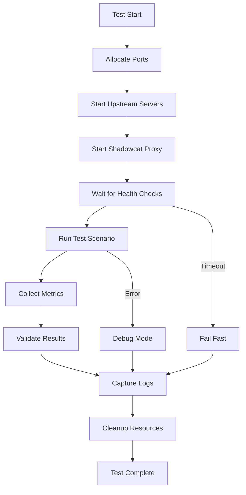

# E2E Test Harness Architecture Design

## Current State Analysis

### Existing Infrastructure in Shadowcat
The shadowcat repository already has substantial test infrastructure:

1. **Existing Framework** (`tests/integration/e2e_framework.rs`)
   - Comprehensive E2E test framework with mock servers
   - OAuth 2.1 flow support
   - Metrics collection
   - Dynamic port allocation (uses `127.0.0.1:0`)
   - Process management for mock servers
   - Rate limiting and circuit breaker testing

2. **Mock Components**
   - `MockMcpServer`: MCP protocol server simulation
   - `MockAuthServer`: OAuth 2.1 authorization server
   - `TestClient`: HTTP client with metrics tracking
   - `MetricsCollector`: Performance and audit metrics

3. **Test Organization**
   - Unit tests: Inline with source code
   - Integration tests: `tests/integration/`
   - E2E tests: `tests/e2e_*_test.rs`
   - Common utilities: `tests/common/`
   - Fixtures: `tests/fixtures/`

### External Components
1. **MCP Validator** (`tools/mcp-validator/`)
   - Reference HTTP server implementation
   - Python-based compliance testing
   - Full MCP protocol support
   - Bearer token authentication

2. **Dynamic Port Support**
   - Shadowcat proxy: Native support for `127.0.0.1:0`
   - MCP validator: Needs investigation
   - Mock servers: Already use dynamic ports

## Proposed Architecture

### 1. Three-Tier Test Strategy

```
┌─────────────────────────────────────────────────────────┐
│                    E2E Test Harness                      │
├─────────────────────────────────────────────────────────┤
│                                                           │
│  Tier 1: Unit Tests (Fast, Isolated)                    │
│  - Mock transports                                       │
│  - Pure function testing                                 │
│  - No external processes                                 │
│  - Run time: <1 second                                   │
│                                                           │
│  Tier 2: Integration Tests (Component Integration)       │
│  - Real transports, mock servers                         │
│  - Database operations                                   │
│  - Session management                                    │
│  - Run time: <10 seconds                                 │
│                                                           │
│  Tier 3: E2E Tests (Full System)                        │
│  - Real MCP servers (validator)                          │
│  - Complete proxy flows                                  │
│  - Multi-client scenarios                                │
│  - Run time: <30 seconds                                 │
│                                                           │
└─────────────────────────────────────────────────────────┘
```

### 2. Process Management Architecture

```rust
pub struct E2EProcessManager {
    processes: HashMap<ProcessId, ManagedProcess>,
    port_allocator: PortAllocator,
    log_aggregator: LogAggregator,
    shutdown_coordinator: ShutdownCoordinator,
}

pub struct ManagedProcess {
    id: ProcessId,
    child: tokio::process::Child,
    stdout_handler: JoinHandle<Vec<String>>,
    stderr_handler: JoinHandle<Vec<String>>,
    health_checker: Box<dyn HealthChecker>,
    restart_policy: RestartPolicy,
}

pub struct PortAllocator {
    allocated_ports: HashSet<u16>,
    min_port: u16,
    max_port: u16,
}
```

### 3. Test Harness Components

```
tests/e2e/
├── harness/
│   ├── mod.rs                    # Main harness module
│   ├── process_manager.rs        # Process lifecycle management
│   ├── port_allocator.rs         # Dynamic port allocation
│   ├── log_aggregator.rs         # Log capture and analysis
│   ├── health_checker.rs         # Process health monitoring
│   └── shutdown_coordinator.rs   # Graceful shutdown
│
├── servers/
│   ├── mod.rs
│   ├── shadowcat_server.rs       # Shadowcat proxy wrapper
│   ├── mcp_validator_server.rs   # MCP validator wrapper
│   ├── mock_upstream.rs          # Mock upstream servers
│   └── server_traits.rs          # Common server interface
│
├── clients/
│   ├── mod.rs
│   ├── mcp_client.rs            # MCP protocol client
│   ├── http_client.rs           # HTTP/SSE client
│   └── stdio_client.rs          # Stdio transport client
│
├── scenarios/
│   ├── mod.rs
│   ├── basic_proxy_flow.rs      # Basic request/response
│   ├── sse_streaming.rs         # SSE connection handling
│   ├── session_management.rs    # Session lifecycle
│   ├── error_recovery.rs        # Error handling
│   ├── rate_limiting.rs         # Rate limit enforcement
│   ├── auth_flows.rs            # Authentication scenarios
│   └── performance.rs           # Load and latency tests
│
└── utils/
    ├── mod.rs
    ├── assertions.rs            # Custom test assertions
    ├── fixtures.rs              # Test data generators
    └── timing.rs                # Timing utilities
```

### 4. Dynamic Port Allocation Strategy

```rust
impl PortAllocator {
    pub async fn allocate(&mut self) -> Result<Port> {
        // Strategy 1: Let OS assign (preferred)
        let listener = TcpListener::bind("127.0.0.1:0").await?;
        let port = listener.local_addr()?.port();
        drop(listener); // Release immediately
        
        // Strategy 2: Range allocation (fallback)
        if port == 0 {
            for candidate in self.min_port..=self.max_port {
                if !self.allocated_ports.contains(&candidate) {
                    if Self::is_port_available(candidate).await {
                        self.allocated_ports.insert(candidate);
                        return Ok(Port::new(candidate));
                    }
                }
            }
        }
        
        Ok(Port::new(port))
    }
}
```

### 5. Log Capture and Analysis

```rust
pub struct LogAggregator {
    collectors: Vec<LogCollector>,
    patterns: HashMap<String, Regex>,
    alerts: Vec<LogAlert>,
}

impl LogAggregator {
    pub fn assert_pattern(&self, pattern: &str) -> Result<()> {
        // Search across all collected logs
    }
    
    pub fn assert_no_errors(&self) -> Result<()> {
        // Check for error patterns
    }
    
    pub fn extract_metrics(&self) -> TestMetrics {
        // Parse performance metrics from logs
    }
}
```

### 6. Test Execution Flow



## Implementation Strategy

### Phase 1: Core Infrastructure (8 hours)
1. Create `E2EProcessManager` for process lifecycle
2. Implement `PortAllocator` with OS allocation
3. Build `LogAggregator` for log capture
4. Add `HealthChecker` trait and implementations

### Phase 2: Server Wrappers (6 hours)
1. Create `ShadowcatServer` wrapper
2. Implement `McpValidatorServer` wrapper
3. Add `MockUpstreamServer` for testing
4. Define common `TestServer` trait

### Phase 3: Client Implementations (6 hours)
1. Build `McpClient` for protocol testing
2. Create `HttpClient` with SSE support
3. Implement `StdioClient` for subprocess
4. Add request/response builders

### Phase 4: Test Scenarios (8 hours)
1. Basic proxy flow validation
2. SSE streaming and reconnection
3. Session management lifecycle
4. Error recovery and resilience
5. Rate limiting enforcement
6. Authentication flows

### Phase 5: Integration (4 hours)
1. Wire up with existing framework
2. Migrate existing tests
3. CI/CD configuration
4. Documentation

## Key Design Decisions

### 1. Process Management
- **Use tokio::process**: Native async support
- **Health checks**: HTTP endpoints or stdio ping
- **Restart policies**: Exponential backoff
- **Resource limits**: Memory and CPU constraints

### 2. Port Allocation
- **Prefer OS allocation**: Use `127.0.0.1:0`
- **Fallback range**: 20000-30000 for CI
- **Port reuse delay**: 1 second minimum
- **Conflict detection**: Pre-bind check

### 3. Log Management
- **Structured logging**: JSON format preferred
- **Log levels**: Capture DEBUG in tests
- **Rotation**: Limit to 100MB per test
- **Aggregation**: Merge by timestamp

### 4. Test Isolation
- **Independent tests**: No shared state
- **Parallel execution**: Thread-safe design
- **Resource cleanup**: Guaranteed via Drop
- **Timeout enforcement**: 30s hard limit

## Integration with MCP Validator

### 1. Validator Wrapper
```rust
pub struct McpValidatorServer {
    process: Child,
    port: u16,
    working_dir: PathBuf,
    python_env: PathBuf,
}

impl McpValidatorServer {
    pub async fn start() -> Result<Self> {
        // 1. Activate Python venv
        // 2. Start reference server
        // 3. Wait for ready signal
        // 4. Return wrapper
    }
}
```

### 2. Compliance Testing
```rust
pub async fn test_mcp_compliance() {
    let validator = McpValidatorServer::start().await?;
    let shadowcat = ShadowcatServer::reverse_proxy()
        .upstream(&validator.url())
        .start().await?;
    
    let client = ComplianceTestClient::new(&shadowcat.url());
    
    // Run compliance suite
    client.test_initialize().await?;
    client.test_tools_list().await?;
    client.test_tool_call().await?;
    client.test_error_handling().await?;
}
```

## Performance Considerations

### 1. Test Execution Speed
- Parallel test execution where possible
- Reusable server instances for test suites
- Lazy initialization of expensive resources
- Connection pooling for clients

### 2. Resource Management
- Process pool limits (max 10 concurrent)
- Memory monitoring (kill if >500MB)
- File descriptor tracking
- Network socket cleanup

### 3. CI/CD Optimization
- Test sharding across workers
- Dependency caching
- Incremental testing
- Fail-fast on critical tests

## Risk Mitigation

| Risk | Impact | Mitigation |
|------|--------|------------|
| Port conflicts | High | Dynamic allocation with retry |
| Process leaks | High | Strict lifecycle management |
| Flaky tests | Medium | Retry logic, timing tolerance |
| Log overflow | Low | Size limits, rotation |
| CI timeouts | Medium | Test parallelization |

## Next Steps

1. **Immediate**: Update tracker with implementation plan
2. **Phase 1**: Build core process management
3. **Phase 2**: Create server wrappers
4. **Phase 3**: Implement test scenarios
5. **Phase 4**: Migrate existing tests
6. **Phase 5**: CI/CD integration

## Success Metrics

- Test suite runs in <5 minutes
- Zero flaky tests over 100 runs
- 90% code coverage for proxy flows
- All MCP compliance tests passing
- Parallel execution with 4+ workers