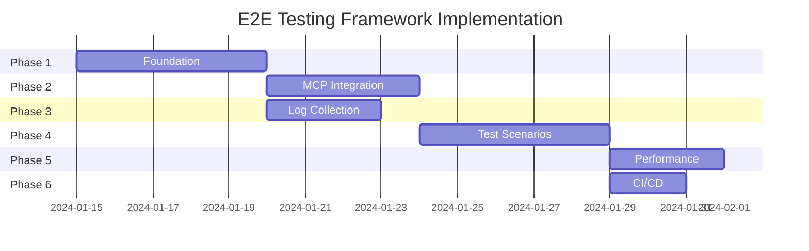

# E2E Testing Framework Implementation Roadmap

## Executive Summary

This roadmap outlines the phased implementation of a comprehensive E2E testing framework for Shadowcat. The framework will provide reliable, fast, and maintainable end-to-end testing with full MCP validator integration.

**Total Estimated Time**: 50-60 hours  
**Priority**: High  
**Risk Level**: Low (builds on existing infrastructure)

## Phase 1: Foundation (Week 1, 15 hours)

### Objectives
- Establish core infrastructure for process and port management
- Create basic test harness structure
- Validate approach with simple tests

### Tasks

| ID | Task | Duration | Dependencies | Deliverable |
|----|------|----------|--------------|------------|
| 1.1 | Create `tests/e2e/` directory structure | 1h | None | Directory layout |
| 1.2 | Implement `ProcessManager` core | 3h | 1.1 | `process_manager.rs` |
| 1.3 | Implement `PortAllocator` with OS assignment | 3h | 1.1 | `port_allocator.rs` |
| 1.4 | Create basic `TestHarness` struct | 2h | 1.2, 1.3 | `harness.rs` |
| 1.5 | Add health check traits and impls | 2h | 1.2 | Health monitoring |
| 1.6 | Write first E2E test (basic proxy) | 2h | 1.4 | `test_basic_proxy.rs` |
| 1.7 | Integrate with existing test suite | 2h | 1.6 | CI validation |

### Success Criteria
- ✅ Process spawning and cleanup works
- ✅ Dynamic port allocation without conflicts
- ✅ Basic E2E test passes locally
- ✅ No interference with existing tests

### Key Code to Implement

```rust
// tests/e2e/harness/process_manager.rs
pub struct ProcessManager {
    processes: Arc<RwLock<HashMap<ProcessId, ManagedProcess>>>,
    shutdown_token: CancellationToken,
}

// tests/e2e/harness/port_allocator.rs
pub struct PortAllocator {
    allocated: Arc<RwLock<HashSet<Port>>>,
    strategy: AllocationStrategy,
}

// tests/e2e/harness/mod.rs
pub struct TestHarness {
    process_manager: Arc<ProcessManager>,
    port_allocator: Arc<PortAllocator>,
}
```

## Phase 2: MCP Validator Integration (Week 1-2, 12 hours)

### Objectives
- Integrate MCP validator as test dependency
- Create wrapper for Python-based validator
- Implement compliance test suite

### Tasks

| ID | Task | Duration | Dependencies | Deliverable |
|----|------|----------|--------------|------------|
| 2.1 | Create `McpValidatorServer` wrapper | 3h | 1.2 | Validator integration |
| 2.2 | Handle Python venv activation | 2h | 2.1 | Environment setup |
| 2.3 | Implement validator health checks | 2h | 2.1, 1.5 | Reliability |
| 2.4 | Port compliance tests to Rust | 3h | 2.1 | `test_mcp_compliance.rs` |
| 2.5 | Add auth token configuration | 2h | 2.4 | Security testing |

### Success Criteria
- ✅ MCP validator starts reliably
- ✅ All compliance tests pass
- ✅ Auth token properly configured
- ✅ Clean shutdown of Python processes

### Key Integration Points

```rust
// tests/e2e/servers/mcp_validator.rs
pub struct McpValidatorServer {
    process: ManagedProcess,
    port: Port,
    auth_token: Option<String>,
    python_env: PathBuf,
}

impl McpValidatorServer {
    pub async fn start(harness: &TestHarness) -> Result<Self> {
        // 1. Allocate port
        // 2. Activate Python venv
        // 3. Start reference server
        // 4. Wait for health check
    }
}
```

## Phase 3: Log Collection System (Week 2, 10 hours)

### Objectives
- Implement comprehensive log capture
- Add pattern matching and assertions
- Enable performance metric extraction

### Tasks

| ID | Task | Duration | Dependencies | Deliverable |
|----|------|----------|--------------|------------|
| 3.1 | Implement `LogCollector` with streams | 3h | 1.2 | Log capture |
| 3.2 | Add log parsing (tracing, JSON) | 2h | 3.1 | Structured logs |
| 3.3 | Create `LogAssertions` trait | 2h | 3.1 | Pattern matching |
| 3.4 | Add metrics extraction | 2h | 3.2 | Performance data |
| 3.5 | Implement CI artifact saving | 1h | 3.1 | Debugging support |

### Success Criteria
- ✅ All process logs captured
- ✅ Pattern assertions work
- ✅ Metrics extracted correctly
- ✅ Logs saved on test failure

## Phase 4: Test Scenarios (Week 2-3, 15 hours)

### Objectives
- Implement comprehensive test scenarios
- Cover all major proxy features
- Add performance and resilience tests

### Tasks

| ID | Task | Duration | Dependencies | Deliverable |
|----|------|----------|--------------|------------|
| 4.1 | Basic proxy flow tests | 2h | 1.6 | Core functionality |
| 4.2 | SSE streaming tests | 3h | 1.6 | SSE support |
| 4.3 | Session management tests | 2h | 4.1 | Session lifecycle |
| 4.4 | Error recovery tests | 3h | 4.1 | Resilience |
| 4.5 | Rate limiting tests | 2h | 4.1 | Rate enforcement |
| 4.6 | Authentication tests | 3h | 2.5 | Security |

### Test Coverage Goals

```rust
// tests/e2e/scenarios/
mod basic_flow;      // Request/response, health checks
mod sse_streaming;   // Long-lived connections, reconnection
mod session_mgmt;    // Creation, timeout, cleanup
mod error_recovery;  // Upstream failures, circuit breaking
mod rate_limiting;   // Enforcement, per-tier limits
mod authentication;  // OAuth, JWT validation
```

## Phase 5: Performance Testing (Week 3, 8 hours)

### Objectives
- Add performance benchmarks
- Implement load testing scenarios
- Validate performance targets

### Tasks

| ID | Task | Duration | Dependencies | Deliverable |
|----|------|----------|--------------|------------|
| 5.1 | Create load generator | 3h | 4.1 | Load testing |
| 5.2 | Implement latency tests | 2h | 3.4 | P95/P99 metrics |
| 5.3 | Add throughput tests | 2h | 5.1 | RPS validation |
| 5.4 | Memory leak detection | 1h | 3.4 | Resource monitoring |

### Performance Targets
- Latency: <5% overhead (P95)
- Throughput: >10,000 req/sec
- Memory: <100MB for 1000 sessions
- CPU: <50% single core at 1000 RPS

## Phase 6: CI/CD Integration (Week 3-4, 5 hours)

### Objectives
- Integrate with GitHub Actions
- Enable parallel test execution
- Add test sharding support

### Tasks

| ID | Task | Duration | Dependencies | Deliverable |
|----|------|----------|--------------|------------|
| 6.1 | Create GitHub Actions workflow | 2h | All | `.github/workflows/e2e.yml` |
| 6.2 | Add test sharding | 1h | 6.1 | Parallel execution |
| 6.3 | Configure artifact upload | 1h | 3.5 | Log preservation |
| 6.4 | Add flaky test detection | 1h | 6.1 | Reliability |

### CI Configuration

```yaml
name: E2E Tests
on: [push, pull_request]

jobs:
  e2e:
    strategy:
      matrix:
        shard: [1, 2, 3, 4]
    steps:
      - name: Run E2E Tests
        run: |
          cargo test --test 'e2e_*' \
            --features e2e-tests \
            -- --test-threads=2
        env:
          TEST_SHARD: ${{ matrix.shard }}
          TEST_TOTAL_SHARDS: 4
```

## Implementation Timeline



## Risk Mitigation

| Risk | Likelihood | Impact | Mitigation |
|------|------------|--------|------------|
| Port conflicts in CI | Medium | High | Use OS allocation, retry logic |
| Python env issues | Low | Medium | Docker fallback option |
| Flaky tests | Medium | Medium | Retry mechanism, timing tolerance |
| Long test duration | High | Low | Parallel execution, sharding |
| Process leaks | Low | High | Strict cleanup, Drop guards |

## Dependencies

### External Dependencies
- `tokio`: Async runtime for process management
- `portpicker`: Port allocation (optional)
- `regex`: Log pattern matching
- `tempfile`: Temporary directories
- `serial_test`: Test serialization (if needed)

### Internal Dependencies
- Existing `MockMcpServer` from integration tests
- Session management components
- Transport implementations

## Migration Strategy

### Step 1: Parallel Development
- Build E2E framework alongside existing tests
- No changes to existing test infrastructure
- Validate with subset of scenarios

### Step 2: Gradual Migration
- Move suitable integration tests to E2E
- Keep unit tests unchanged
- Update CI to run both suites

### Step 3: Full Integration
- All system-level tests use E2E framework
- Deprecate old integration test patterns
- Update documentation

## Success Metrics

### Quantitative
- ✅ Test execution time <5 minutes
- ✅ Zero flaky tests over 100 runs
- ✅ 90% code coverage for proxy flows
- ✅ All MCP compliance tests pass
- ✅ <1% test failure rate in CI

### Qualitative
- ✅ Easy to add new test scenarios
- ✅ Clear test failure messages
- ✅ Minimal maintenance burden
- ✅ Good developer experience

## Next Steps

1. **Immediate** (Today)
   - Create `tests/e2e/` directory structure
   - Start implementing `ProcessManager`
   - Set up basic test harness

2. **This Week**
   - Complete Phase 1 foundation
   - Begin MCP validator integration
   - Get first E2E test passing

3. **Next Week**
   - Complete validator integration
   - Add log collection
   - Implement core test scenarios

4. **Following Week**
   - Performance testing
   - CI/CD integration
   - Documentation

## Conclusion

This roadmap provides a clear path to implementing a robust E2E testing framework for Shadowcat. The phased approach minimizes risk while delivering value incrementally. The framework will significantly improve test reliability, debugging capabilities, and development velocity.

**Key Benefits**:
- 🚀 Faster test execution through parallelization
- 🔍 Better debugging with comprehensive log capture
- ✅ Higher confidence through MCP compliance testing
- 📊 Performance validation with metrics extraction
- 🤖 CI/CD ready with automatic artifact collection

**Recommended Action**: Begin Phase 1 implementation immediately, focusing on the core `ProcessManager` and `PortAllocator` components.