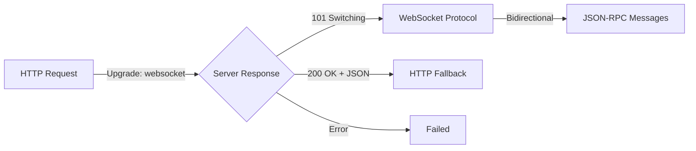

# WebSocket Transport Design for Future Implementation

## Status: UPDATED - WebSocket is part of HTTP Transport

**UPDATE 2025-08-24**: WebSocket is now understood to be a **mode of the HTTP transport**, not a separate transport. The server can respond to an HTTP request with:
- 200 OK + application/json (single response)
- 200 OK + text/event-stream (SSE streaming)
- 101 Switching Protocols (WebSocket upgrade)

See [http-transport-unified-architecture.md](http-transport-unified-architecture.md) for the current architecture.

---

## Original Design (Now Integrated into HTTP Transport)

WebSocket support for MCP is being discussed in [modelcontextprotocol#1288](https://github.com/modelcontextprotocol/modelcontextprotocol/issues/1288). This document outlined how we'd add WebSocket as a separate transport, but it's now understood to be part of the HTTP transport.

## WebSocket Protocol Characteristics

### The Three-Phase Nature



1. **HTTP Phase**: Standard HTTP request with Upgrade headers
2. **Negotiation Phase**: Server accepts or rejects upgrade
3. **WebSocket Phase** OR **HTTP Fallback**: Depending on server response

### Protocol Comparison

| Aspect | HTTP | SSE | WebSocket | Stdio |
|--------|------|-----|-----------|-------|
| **Initiation** | HTTP Request | HTTP GET | HTTP Upgrade | Direct stream |
| **Direction** | Request/Response | Server→Client | Bidirectional | Bidirectional |
| **Message Format** | JSON body | `data: json\n\n` | JSON in WS frame | JSON + newline |
| **Connection** | Per request | Long-lived | Long-lived | Continuous |
| **Fallback** | N/A | Regular HTTP | HTTP response | N/A |

## Design Approach

### Option 1: State Machine Transport (Recommended)

```rust
pub struct WebSocketTransport {
    url: Url,
    state: Arc<Mutex<WsState>>,
}

enum WsState {
    /// Initial state - ready to connect
    Disconnected,
    
    /// Attempting WebSocket upgrade
    Connecting {
        auth: Option<AuthToken>,
    },
    
    /// WebSocket connected - bidirectional streaming
    Streaming {
        sink: SplitSink<WebSocketStream<MaybeTlsStream<TcpStream>>, Message>,
        stream: SplitStream<WebSocketStream<MaybeTlsStream<TcpStream>>>,
    },
    
    /// HTTP fallback - single response
    HttpResponse {
        response: Option<Value>,
    },
}

impl Transport for WebSocketTransport {
    async fn connect(&mut self) -> Result<()> {
        // Attempt WebSocket upgrade
        // Transition to Streaming or HttpResponse
    }
    
    async fn send(&mut self, msg: Value) -> Result<()> {
        match &*self.state.lock().await {
            WsState::Streaming { sink, .. } => {
                // Send over WebSocket
            }
            WsState::HttpResponse { .. } => {
                // Can't send in HTTP fallback mode
                Err(Error::NotSupported)
            }
            _ => Err(Error::NotConnected),
        }
    }
    
    async fn receive(&mut self) -> Result<Option<Value>> {
        match &*self.state.lock().await {
            WsState::Streaming { stream, .. } => {
                // Receive from WebSocket
            }
            WsState::HttpResponse { response } => {
                // Return single HTTP response
                Ok(response.take())
            }
            _ => Err(Error::NotConnected),
        }
    }
}
```

### Option 2: Composite Transport

```rust
pub struct WebSocketTransport {
    inner: WebSocketInner,
}

enum WebSocketInner {
    Http(HttpTransport),           // For negotiation & fallback
    WebSocket(WsStreamTransport),  // After upgrade
}

// Delegate to appropriate transport
impl Transport for WebSocketTransport {
    async fn send(&mut self, msg: Value) -> Result<()> {
        match &mut self.inner {
            WebSocketInner::Http(t) => t.send(msg).await,
            WebSocketInner::WebSocket(t) => t.send(msg).await,
        }
    }
}
```

### Option 3: Transformer Pattern

```rust
impl HttpTransport {
    /// Attempt to upgrade to WebSocket
    pub async fn upgrade_to_websocket(self) -> Result<WebSocketTransport> {
        // Send upgrade request
        // If successful, consume self and return WebSocketTransport
        // If failed, return error (caller still has HttpTransport)
    }
}
```

## Integration Points

### With Current Architecture

```rust
// Our current transport trait works perfectly
pub trait Transport: Send + Sync {
    async fn send(&mut self, message: Value) -> Result<()>;
    async fn receive(&mut self) -> Result<Option<Value>>;
    async fn close(&mut self) -> Result<()>;
}

// WebSocket just becomes another implementation
impl Transport for WebSocketTransport { ... }

// Client/Server work unchanged
let transport = WebSocketTransport::new("ws://localhost:8080/mcp");
let client = Client::new(transport, handler);
```

### Authentication (Per MCP Spec)

```rust
impl WebSocketTransport {
    /// Cookie-based auth
    pub fn with_cookies(mut self, cookies: Vec<Cookie>) -> Self {
        self.auth = Auth::Cookies(cookies);
        self
    }
    
    /// Token-based auth (URL parameter)
    pub fn with_token(mut self, token: String) -> Self {
        self.auth = Auth::Token(token);
        self
    }
}
```

### Session Management (Per MCP Spec)

```rust
impl WebSocketTransport {
    async fn handle_reconnection(&mut self) -> Result<()> {
        // MCP spec: "MUST close previous connections"
        if let WsState::Streaming { .. } = &*self.state.lock().await {
            self.close().await?;
        }
        self.connect().await
    }
}
```

## Implementation Dependencies

### Required Crates
```toml
[dependencies]
tokio-tungstenite = "0.21"  # WebSocket protocol
http = "1.0"                # HTTP types for upgrade
futures-util = "0.3"         # Stream/Sink traits
```

### Key Types
```rust
use tokio_tungstenite::{
    WebSocketStream,
    MaybeTlsStream,
    connect_async,
    tungstenite::{Message, Error as WsError},
};
use futures_util::{SinkExt, StreamExt};
```

## Testing Strategy

### Unit Tests
```rust
#[test]
async fn test_websocket_upgrade_success() {
    // Mock server that accepts upgrade
    let transport = WebSocketTransport::new("ws://mock");
    transport.connect().await.unwrap();
    assert!(transport.is_streaming());
}

#[test]
async fn test_websocket_fallback_http() {
    // Mock server that rejects upgrade
    let transport = WebSocketTransport::new("ws://mock");
    transport.connect().await.unwrap();
    assert!(transport.is_http_fallback());
    
    // Should return single response
    let response = transport.receive().await.unwrap();
    assert!(response.is_some());
    
    // Second receive should return None
    let response = transport.receive().await.unwrap();
    assert!(response.is_none());
}
```

### Integration Tests
```rust
#[test]
async fn test_websocket_with_echo_server() {
    // Use actual WebSocket echo server
    let transport = WebSocketTransport::new("wss://echo.websocket.org");
    let client = Client::new(transport, handler);
    // Test bidirectional communication
}
```

## Migration Path

### Phase 1: Add WebSocketTransport
1. Implement basic WebSocket transport
2. Add to transport module
3. Test with WebSocket echo servers

### Phase 2: MCP Compliance
1. Add authentication support
2. Implement session management
3. Handle reconnection per spec

### Phase 3: Production Features
1. Add connection pooling
2. Implement heartbeat/keepalive
3. Add metrics and monitoring

## Design Decisions

### Why State Machine Pattern?
- **Clear state transitions**: HTTP → WebSocket or HTTP → Fallback
- **Type safety**: Can't send on HTTP fallback
- **Debuggability**: Easy to see current state

### Why Not Extend HttpTransport?
- **Separation of concerns**: HTTP and WebSocket are different enough
- **Complexity**: Would make HttpTransport much more complex
- **Testing**: Easier to test separately

### Why Not Use StreamTransport?
- **Protocol mismatch**: WebSocket has frames, not line-delimited
- **Upgrade handling**: Need HTTP phase first
- **Fallback support**: Must handle non-upgraded case

## Conclusion

WebSocket transport fits cleanly into our architecture:
1. Implements the same `Transport` trait
2. Handles its unique three-phase nature internally
3. Provides clean API to Client/Server
4. Doesn't require changes to existing code

The design is ready to implement when MCP WebSocket specification is finalized.