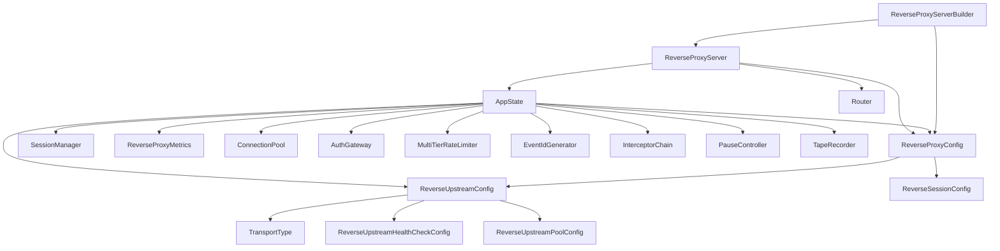
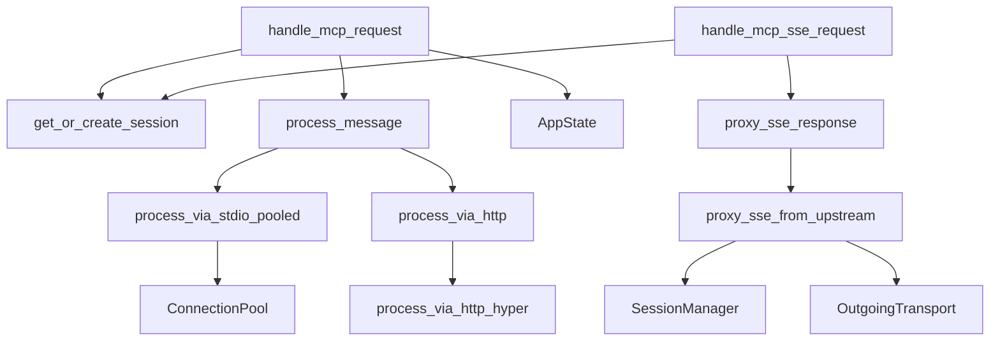

# Internal Dependencies in legacy.rs

## Core Struct Relationships



## Function Dependencies

### Main Request Handlers



## AppState Field Usage

### SessionManager Dependencies
**Used by:**
- `get_or_create_session()`
- `handle_mcp_request()`
- `handle_mcp_sse_request()`
- `proxy_sse_from_upstream()`

**Operations:**
- `get_session()`
- `update_session()`
- `get_or_create()`

### ConnectionPool Dependencies
**Used by:**
- `process_via_stdio_pooled()`
- Server initialization

**Operations:**
- `acquire()`
- `release()`

### InterceptorChain Dependencies
**Used by:**
- `handle_mcp_request()`
- Message processing flow

**Operations:**
- `intercept()`

### TapeRecorder Dependencies
**Used by:**
- `handle_mcp_request()`
- `get_or_create_session()`
- Response recording

**Operations:**
- `record_request()`
- `record_response()`

### Metrics Dependencies
**Used by:**
- `handle_mcp_request()`
- `handle_metrics()`
- Error handlers

**Operations:**
- `record_request()`
- `increment_errors()`

## Coupling Analysis

### Tightly Coupled Components

1. **AppState ↔ Request Handlers**
   - All handlers depend on AppState
   - Cannot function without AppState fields
   - Direct field access throughout

2. **SessionManager ↔ Session Operations**
   - Central to all session-related functions
   - Shared across multiple handlers
   - Thread-safe Arc wrapper required

3. **Transport Processing ↔ ConnectionPool**
   - Stdio transport requires pool
   - Pool lifecycle tied to server

### Loosely Coupled Components

1. **Configuration Types**
   - Self-contained with defaults
   - Only used during initialization
   - Can be extracted easily

2. **Metrics Collection**
   - Optional component
   - Simple atomic operations
   - No reverse dependencies

3. **Admin Endpoints**
   - Minimal dependencies
   - Could be feature-gated
   - Simple request/response

## Hidden Dependencies

### Through Closures
```rust
// Middleware closures capture app_state
middleware::from_fn_with_state(app_state.clone(), handler)
```

### Through Extensions
```rust
// Auth context passed via request extensions
req.extensions().get::<AuthContext>()
```

### Through Async Tasks
```rust
// Spawned tasks capture Arc references
tokio::spawn(async move {
    // Uses cloned Arc<AppState>
})
```

## Circular Dependency Risks

### Potential Cycles
1. **None identified** - The architecture uses Arc for shared ownership, avoiding direct cycles
2. **Risk Area**: If handlers start calling each other directly

### Mitigation
- All shared state through Arc
- No direct struct-to-struct references
- Handler functions are standalone

## Component Extraction Difficulty

### Easy to Extract (Score: 1-3)
1. **Config Types** (Score: 1)
   - No runtime dependencies
   - Pure data structures
   - ~300 lines

2. **Metrics** (Score: 2)
   - Simple atomic operations
   - Optional component
   - ~40 lines

3. **Error Types** (Score: 2)
   - Self-contained
   - Used everywhere but no deps
   - ~30 lines

### Medium Difficulty (Score: 4-6)
4. **Admin Endpoints** (Score: 4)
   - Depends on AppState for metrics
   - Could mock metrics interface
   - ~150 lines

5. **Session Helpers** (Score: 5)
   - Depends on SessionManager
   - Used by multiple handlers
   - ~100 lines

6. **Transport Processing** (Score: 5)
   - Depends on pools and transports
   - Multiple variants (stdio/HTTP)
   - ~400 lines

### Difficult to Extract (Score: 7-10)
7. **SSE Handlers** (Score: 7)
   - Complex async streaming
   - Multiple dependencies
   - ~550 lines

8. **Main Request Handler** (Score: 9)
   - Depends on everything
   - Core orchestration logic
   - 550 lines

9. **Server Setup** (Score: 8)
   - Router configuration
   - Middleware setup
   - State initialization
   - ~500 lines

## Extraction Dependencies

### Phase 1 - No Dependencies
Can extract immediately:
- Config types
- Error types
- Metrics types
- Constants

### Phase 2 - Single Dependencies
After Phase 1:
- Builders (needs configs)
- Validators (needs configs)
- Response helpers (needs errors)

### Phase 3 - Multiple Dependencies
After Phase 2:
- Session helpers (needs manager, configs)
- Transport routers (needs configs, pools)
- Admin endpoints (needs metrics, state)

### Phase 4 - Complex Integration
Last to extract:
- Request handlers (needs everything)
- SSE handlers (needs everything)
- Server setup (needs everything)

## Risk Mitigation Strategies

1. **Create Traits First**
   - Define interfaces before extraction
   - Enable mocking and testing

2. **Extract Data Types**
   - Move configs and errors first
   - No behavior, just data

3. **Use Facade Pattern**
   - Hide AppState complexity
   - Provide focused interfaces

4. **Incremental Extraction**
   - One module at a time
   - Maintain tests at each step