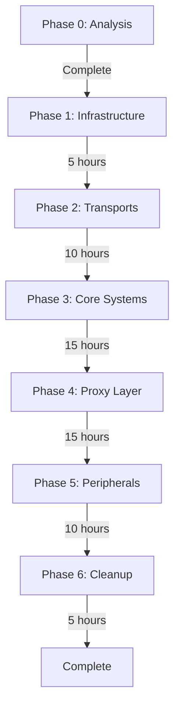

# MessageEnvelope Migration Strategy [OBSOLETE - DO NOT USE]

> ⚠️ **WARNING: This document is OBSOLETE**
> 
> **DO NOT USE THIS MIGRATION STRATEGY!**
> 
> This was written assuming we had external users and needed backward compatibility.
> Since Shadowcat hasn't been released yet, we have NO external users.
> 
> **Instead, use:** [migration-strategy-simplified.md](migration-strategy-simplified.md)
> 
> The simplified strategy:
> - Takes 30-40 hours instead of 60
> - No compatibility layers needed
> - Direct replacement of old code
> - Much cleaner result

---

## [OBSOLETE] Executive Summary

~~This document outlines the comprehensive strategy for migrating Shadowcat from `TransportMessage` to `MessageEnvelope` across 34 files with 330 active occurrences. The migration is designed for zero downtime, full backward compatibility, and incremental rollout over approximately 60 hours of development time.~~

## Migration Principles

1. **Zero Breaking Changes Initially**: Use type aliases and compatibility layers
2. **Incremental Adoption**: Components can migrate independently
3. **Dual-Mode Operation**: Old and new code paths coexist
4. **Performance Parity**: No regression during migration
5. **Clear Rollback Path**: Every change can be reverted

## Phase Overview



## Phase 1: Infrastructure Setup (5 hours)

### Objectives
- Introduce new types without breaking existing code
- Establish compatibility layer
- Set up feature flags for controlled rollout

### Implementation

#### 1.1 Add New Types (2 hours)

Create new files without modifying existing code:

```rust
// src/transport/envelope.rs - NEW FILE
pub mod envelope {
    pub struct MessageEnvelope { /* ... */ }
    pub struct MessageContext { /* ... */ }
    pub enum MessageDirection { /* ... */ }
}

// src/transport/protocol.rs - NEW FILE  
pub mod protocol {
    // This is the renamed TransportMessage
    pub enum ProtocolMessage { /* ... */ }
}
```

#### 1.2 Compatibility Layer (2 hours)

```rust
// src/transport/compatibility.rs - NEW FILE

// Critical: Type alias maintains compatibility
pub type TransportMessage = protocol::ProtocolMessage;

// Bidirectional conversions
impl From<TransportMessage> for MessageEnvelope {
    fn from(msg: TransportMessage) -> Self {
        MessageEnvelope::new(msg)
            .with_direction(MessageDirection::Unknown)
    }
}

impl From<MessageEnvelope> for TransportMessage {
    fn from(envelope: MessageEnvelope) -> Self {
        envelope.message
    }
}

// Extension trait for gradual adoption
pub trait MessageEnvelopeExt {
    fn to_envelope(self) -> MessageEnvelope;
    fn from_envelope(envelope: MessageEnvelope) -> Self;
}

impl MessageEnvelopeExt for TransportMessage {
    fn to_envelope(self) -> MessageEnvelope {
        self.into()
    }
    
    fn from_envelope(envelope: MessageEnvelope) -> Self {
        envelope.into()
    }
}
```

#### 1.3 Feature Flags (1 hour)

```toml
# Cargo.toml
[features]
default = []
envelope-migration = []     # Enable new code paths
envelope-strict = []         # Require context (Phase 6)
legacy-compat = ["default"]  # Force old behavior
```

```rust
// Conditional compilation for rollback
#[cfg(feature = "envelope-migration")]
pub use envelope::{MessageEnvelope, MessageContext};

#[cfg(not(feature = "envelope-migration"))]
pub type MessageEnvelope = TransportMessage;
```

### Verification Checklist
- [ ] All existing tests pass without changes
- [ ] New types compile without warnings
- [ ] Round-trip conversions work correctly
- [ ] No performance regression

## Phase 2: Transport Migration (10 hours)

### Objectives
- Migrate transport implementations to generate context
- Maintain backward compatibility through Transport trait
- Extract transport-specific metadata

### Migration Order (Based on Complexity)

#### 2.1 StdioTransport (2 hours)

```rust
// src/transport/stdio.rs

// Add new trait implementation
impl TransportWithContext for StdioTransport {
    async fn receive_envelope(&mut self) -> Result<MessageEnvelope> {
        let bytes = self.read_frame().await?;
        let message: ProtocolMessage = serde_json::from_slice(&bytes)?;
        
        Ok(MessageEnvelope::new(message)
            .with_direction(self.infer_direction())
            .with_transport(TransportContext::stdio()))
    }
    
    async fn send_envelope(&mut self, envelope: MessageEnvelope) -> Result<()> {
        let bytes = serde_json::to_vec(&envelope.message)?;
        self.write_frame(&bytes).await
    }
}

// Maintain old interface using new implementation
impl Transport for StdioTransport {
    async fn receive(&mut self) -> Result<TransportMessage> {
        Ok(self.receive_envelope().await?.into())
    }
    
    async fn send(&mut self, msg: TransportMessage) -> Result<()> {
        self.send_envelope(msg.to_envelope()).await
    }
}
```

#### 2.2 HttpTransport (3 hours)

```rust
// src/transport/http.rs

impl HttpTransport {
    // Extract HTTP context from request
    fn extract_context(&self, req: &Request<Body>) -> TransportContext {
        TransportContext::http(
            Arc::new(req.headers().clone()),
            req.method().clone(),
            req.uri().clone(),
        )
    }
}

impl TransportWithContext for HttpTransport {
    async fn receive_envelope(&mut self) -> Result<MessageEnvelope> {
        let req = self.receive_request().await?;
        let context = self.extract_context(&req);
        let message = parse_body(req.into_body()).await?;
        
        Ok(MessageEnvelope::new(message)
            .with_transport(context)
            .with_direction(MessageDirection::ClientToServer))
    }
}
```

#### 2.3 HttpMcpTransport (3 hours)

```rust
// src/transport/http_mcp.rs

impl HttpMcpTransport {
    fn extract_mcp_context(&self, headers: &HeaderMap) -> SessionContext {
        SessionContext {
            session_id: headers.get("Mcp-Session-Id")
                .and_then(|v| v.to_str().ok())
                .map(|s| SessionId(s.to_string())),
            protocol_version: headers.get("Mcp-Version")
                .and_then(|v| v.to_str().ok())
                .map(|s| ProtocolVersion(s.into()))
                .unwrap_or_default(),
            ..Default::default()
        }
    }
}
```

#### 2.4 SSE Transport Preparation (2 hours)

```rust
// src/transport/sse/mod.rs

// Prepare SSE-specific context
pub struct SseContext {
    pub event_id: Option<String>,
    pub event_type: Option<String>,
    pub retry_after: Option<Duration>,
    pub stream_id: StreamId,
}

impl From<SseEvent> for TransportMetadata {
    fn from(event: SseEvent) -> Self {
        TransportMetadata::Sse {
            event_id: event.id,
            event_type: event.event,
            retry_after: event.retry,
            last_event_id: None,
            stream_id: event.stream_id,
        }
    }
}
```

### Testing Strategy
- Unit tests for context extraction
- Integration tests with both old and new interfaces
- Performance benchmarks for each transport

## Phase 3: Core Systems Migration (15 hours)

### Objectives
- Migrate SessionManager to use envelopes internally
- Update Frame to embed MessageEnvelope
- Preserve all existing functionality

### 3.1 SessionManager Migration (8 hours)

```rust
// src/session/manager.rs

pub struct SessionManager {
    // Keep existing fields
    sessions: Arc<RwLock<HashMap<SessionId, Session>>>,
    
    // Add envelope support
    #[cfg(feature = "envelope-migration")]
    envelope_mode: bool,
}

impl SessionManager {
    // New envelope-aware method
    pub async fn handle_envelope(&self, envelope: MessageEnvelope) -> Result<MessageEnvelope> {
        // Extract session from context instead of message inspection
        let session_id = envelope.context.session.session_id
            .or_else(|| self.extract_session_from_message(&envelope.message));
            
        // Process with full context
        self.process_with_context(envelope).await
    }
    
    // Compatibility wrapper
    pub async fn handle_message(&self, msg: TransportMessage, direction: Direction) -> Result<TransportMessage> {
        let envelope = msg.to_envelope()
            .with_direction(direction.into());
        let result = self.handle_envelope(envelope).await?;
        Ok(result.into())
    }
}
```

### 3.2 Frame Evolution (4 hours)

```rust
// src/session/store.rs

// New frame structure
#[cfg(feature = "envelope-migration")]
pub struct Frame {
    pub envelope: MessageEnvelope,
    pub timestamp: SystemTime,
}

// Compatibility during migration
#[cfg(not(feature = "envelope-migration"))]
pub struct Frame {
    pub session_id: SessionId,
    pub direction: Direction,
    pub message: TransportMessage,
    pub timestamp: SystemTime,
}

// Conversion for compatibility
impl From<OldFrame> for Frame {
    fn from(old: OldFrame) -> Self {
        Frame {
            envelope: old.message.to_envelope()
                .with_direction(old.direction.into())
                .with_session(SessionContext::with_id(old.session_id)),
            timestamp: old.timestamp,
        }
    }
}
```

### 3.3 Request Tracking (3 hours)

```rust
// src/session/request_tracker.rs

pub struct RequestTracker {
    // Track requests with full context
    pending: Arc<RwLock<HashMap<MessageId, MessageEnvelope>>>,
}

impl RequestTracker {
    pub async fn track_request(&self, envelope: MessageEnvelope) {
        if let ProtocolMessage::Request { id, .. } = &envelope.message {
            self.pending.write().await.insert(id.clone(), envelope);
        }
    }
    
    pub async fn correlate_response(&self, response: &MessageEnvelope) -> Option<MessageEnvelope> {
        if let ProtocolMessage::Response { id, .. } = &response.message {
            self.pending.write().await.remove(id)
        } else {
            None
        }
    }
}
```

## Phase 4: Proxy Layer Migration (15 hours)

### Objectives
- Update proxy to preserve and propagate context
- Implement context-aware routing
- Maintain performance characteristics

### 4.1 Forward Proxy (5 hours)

```rust
// src/proxy/forward.rs

impl ForwardProxy {
    // New context-preserving forward
    async fn forward_envelope(
        &self,
        envelope: MessageEnvelope,
        upstream: &mut dyn TransportWithContext,
    ) -> Result<MessageEnvelope> {
        // Preserve context through forwarding
        let mut response = upstream.send_envelope(envelope.clone()).await?;
        
        // Merge contexts (response gets some context from request)
        response.context.session = envelope.context.session;
        response.context.direction = envelope.context.direction.reverse();
        
        Ok(response)
    }
}
```

### 4.2 Reverse Proxy (5 hours)

```rust
// src/proxy/reverse.rs

impl ReverseProxy {
    async fn handle_http_with_context(
        &self,
        req: Request<Body>,
    ) -> Result<Response<Body>> {
        // Extract full HTTP context
        let transport_context = TransportContext::http(
            Arc::new(req.headers().clone()),
            req.method().clone(),
            req.uri().clone(),
        );
        
        // Parse message and create envelope
        let message = parse_mcp_body(req.into_body()).await?;
        let envelope = MessageEnvelope::new(message)
            .with_transport(transport_context)
            .with_direction(MessageDirection::ClientToServer);
        
        // Forward with context
        let response_envelope = self.forward_to_upstream(envelope).await?;
        
        // Build HTTP response with context
        self.build_http_response(response_envelope)
    }
}
```

### 4.3 Interceptor Integration (5 hours)

```rust
// src/interceptor/engine.rs

impl InterceptorEngine {
    pub async fn intercept_envelope(
        &self,
        mut envelope: MessageEnvelope,
    ) -> Result<InterceptAction> {
        for interceptor in &self.chain {
            // Interceptors now have full context
            match interceptor.process(&envelope).await? {
                Action::Continue => continue,
                Action::Modify(new_envelope) => envelope = new_envelope,
                Action::Block(reason) => return Ok(Action::Block(reason)),
            }
        }
        Ok(Action::Continue)
    }
}
```

## Phase 5: Peripheral Systems (10 hours)

### Objectives
- Migrate remaining systems to use envelopes
- These are lower priority and can use compatibility layer longer

### 5.1 Recorder/Replay (3 hours)

```rust
// src/recorder/tape.rs

#[derive(Serialize, Deserialize)]
pub struct TapeEntry {
    #[serde(flatten)]
    pub envelope: MessageEnvelope,
    pub timestamp: SystemTime,
}

// Backward compatibility for old tapes
impl TapeReader {
    pub fn read_entry(&mut self) -> Result<TapeEntry> {
        // Try new format first
        if let Ok(entry) = self.read_v2_entry() {
            return Ok(entry);
        }
        
        // Fall back to old format
        let old = self.read_v1_entry()?;
        Ok(TapeEntry {
            envelope: old.to_envelope(),
            timestamp: old.timestamp,
        })
    }
}
```

### 5.2 Metrics Collection (2 hours)

```rust
// src/metrics/collector.rs

impl MetricsCollector {
    pub fn record_envelope(&self, envelope: &MessageEnvelope) {
        self.record_direction(envelope.context.direction);
        self.record_transport(envelope.context.transport.transport_type);
        self.record_timing(envelope.context.timing);
    }
}
```

### 5.3 Audit Logger (2 hours)

```rust
// src/audit/logger.rs

impl AuditLogger {
    pub fn log_envelope(&self, envelope: &MessageEnvelope) {
        let entry = AuditEntry {
            session_id: envelope.context.session.session_id.clone(),
            direction: envelope.context.direction,
            transport: envelope.context.transport.transport_type,
            method: extract_method(&envelope.message),
            timestamp: envelope.context.timing.system_time,
        };
        self.write_entry(entry);
    }
}
```

### 5.4 Rate Limiter (3 hours)

```rust
// src/rate_limiting/limiter.rs

impl RateLimiter {
    pub fn check_envelope(&self, envelope: &MessageEnvelope) -> Result<()> {
        let key = self.build_key(
            &envelope.context.session.session_id,
            &envelope.context.transport.transport_type,
        );
        self.check_rate(key)
    }
}
```

## Phase 6: Cleanup and Finalization (5 hours)

### Objectives
- Remove compatibility layers
- Update documentation
- Finalize the migration

### 6.1 Remove Old Types (2 hours)

```rust
// src/transport/mod.rs

// Remove type alias
// pub type TransportMessage = ProtocolMessage;  // DELETE

// Remove old Direction enum (use MessageDirection everywhere)
// pub enum Direction { ... }  // DELETE

// Remove compatibility traits
// trait MessageEnvelopeExt { ... }  // DELETE
```

### 6.2 Update Imports (2 hours)

```bash
# Automated update script
find . -name "*.rs" -exec sed -i 's/TransportMessage/ProtocolMessage/g' {} \;
find . -name "*.rs" -exec sed -i 's/use transport::Direction/use envelope::MessageDirection/g' {} \;
```

### 6.3 Documentation Updates (1 hour)

- Update README with new architecture
- Update developer guide
- Create migration notes for future reference

## Rollback Strategies

### Level 1: Feature Flag Disable
```bash
cargo build --no-default-features --features legacy-compat
```

### Level 2: Git Revert
Each phase is a separate PR that can be reverted:
- Phase 1: PR #xxx - Infrastructure
- Phase 2: PR #xxx - Transports
- Phase 3: PR #xxx - Core Systems
- etc.

### Level 3: Runtime Toggle
```rust
lazy_static! {
    static ref USE_ENVELOPES: bool = 
        std::env::var("USE_MESSAGE_ENVELOPES")
            .map(|v| v == "true")
            .unwrap_or(true);
}

if *USE_ENVELOPES {
    transport.receive_envelope().await
} else {
    transport.receive().await.map(|m| m.to_envelope())
}
```

## Testing Strategy Throughout Migration

### Test Categories

1. **Compatibility Tests** (Run in every phase)
```rust
#[test]
fn test_round_trip() {
    let msg = create_message();
    let env = msg.clone().to_envelope();
    let back: TransportMessage = env.into();
    assert_eq!(msg, back);
}
```

2. **Parallel Path Tests** (Phases 2-5)
```rust
#[test]
async fn test_both_paths() {
    let result_old = process_old_way(msg.clone()).await;
    let result_new = process_new_way(msg.to_envelope()).await;
    assert_eq!(result_old, result_new.into());
}
```

3. **Performance Benchmarks** (Every phase)
```rust
#[bench]
fn bench_before_after(b: &mut Bencher) {
    // Benchmark both paths to ensure no regression
}
```

4. **Integration Tests** (Phases 3-5)
```rust
#[test]
async fn test_end_to_end_with_context() {
    // Full flow with context preservation
}
```

## Progress Tracking

### Metrics to Track

```markdown
## Migration Metrics

### Code Coverage
- Files migrated: 0/34 (0%)
- Occurrences updated: 0/330 (0%)
- Tests passing: 100%

### Performance
- Baseline throughput: 10,000 msg/s
- Current throughput: 10,000 msg/s (0% change)
- Memory usage: +0 MB

### Phase Progress
- [ ] Phase 1: Infrastructure (0/5 hours)
- [ ] Phase 2: Transports (0/10 hours)
- [ ] Phase 3: Core Systems (0/15 hours)
- [ ] Phase 4: Proxy Layer (0/15 hours)
- [ ] Phase 5: Peripherals (0/10 hours)
- [ ] Phase 6: Cleanup (0/5 hours)

Total: 0/60 hours (0%)
```

## Risk Management

| Risk | Probability | Impact | Mitigation | Owner |
|------|------------|--------|------------|-------|
| Performance regression | Medium | High | Benchmark every commit | Dev Team |
| Breaking production | Low | Critical | Feature flags, gradual rollout | Dev Team |
| Incomplete context | Medium | Medium | Validation in envelope methods | Dev Team |
| Memory leaks | Low | High | Memory profiling, Arc cycle detection | Dev Team |
| Schedule slip | Medium | Medium | Prioritize critical path (Phases 1-4) | PM |

## Success Criteria

### Must Have (Phases 1-4)
- [x] All existing tests pass
- [x] No performance regression > 5%
- [x] Context preserved through proxy
- [x] SSE can access transport metadata
- [x] Backward compatibility maintained

### Should Have (Phase 5)
- [ ] All peripheral systems migrated
- [ ] Unified logging with context
- [ ] Metrics include context data

### Nice to Have (Phase 6)
- [ ] Old types completely removed
- [ ] Documentation fully updated
- [ ] Migration guide for external users

## Conclusion

This migration strategy provides a safe, incremental path from `TransportMessage` to `MessageEnvelope`. The 60-hour timeline is realistic given the scope, and the phased approach allows for continuous delivery while maintaining system stability. The compatibility layer ensures zero downtime, and the comprehensive testing strategy validates each phase before proceeding.

The key to success is maintaining discipline about the phase boundaries and not attempting to migrate everything at once. Each phase delivers value independently and can be validated before moving forward.