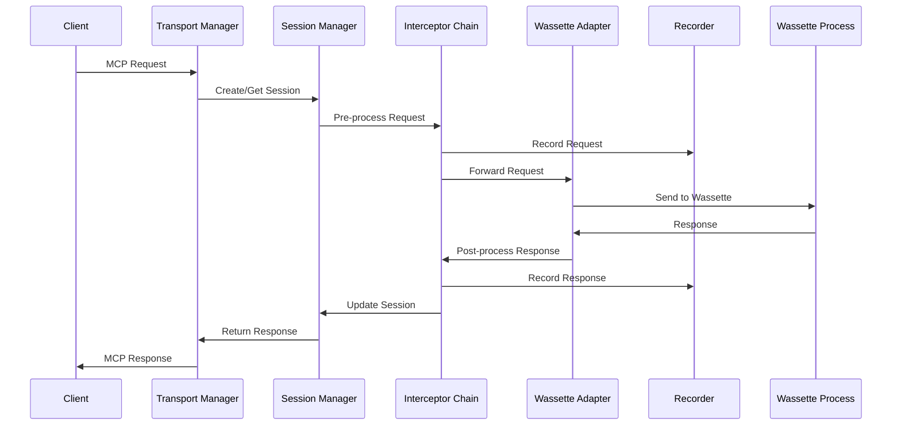
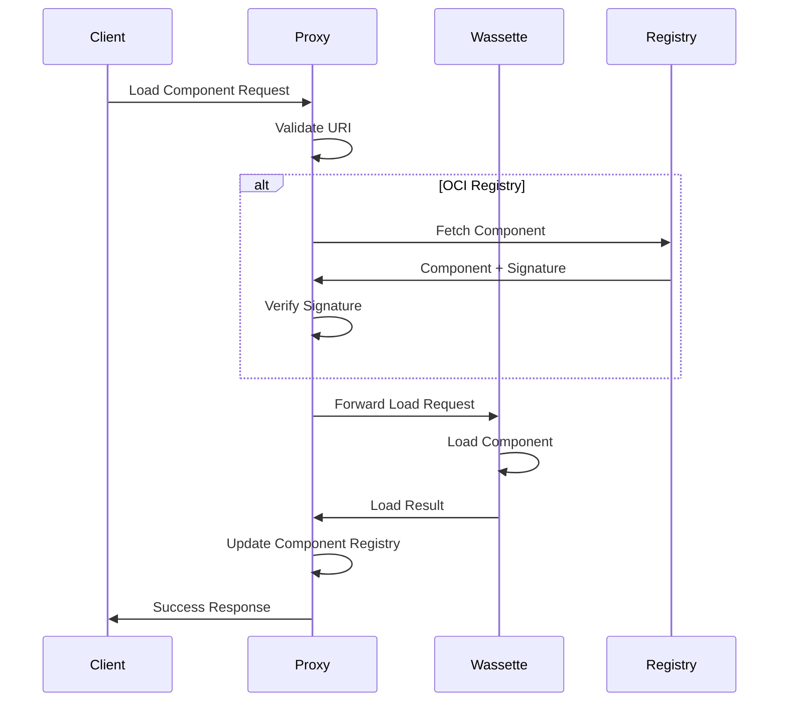

# Wassette-Shadowcat Proxy Architecture

## Overview

The proxy architecture enables Shadowcat to transparently intercept, record, and modify MCP traffic between clients and Wassette's WebAssembly runtime. This document provides the detailed technical design for the proxy implementation.

## Component Architecture

```
┌─────────────────────────────────────────────────────────────┐
│                        Shadowcat Proxy                       │
├─────────────────────────────────────────────────────────────┤
│  ┌─────────────┐  ┌──────────────┐  ┌──────────────┐      │
│  │  Transport  │  │   Session    │  │  Interceptor │      │
│  │   Manager   │  │   Manager    │  │    Chain     │      │
│  └──────┬──────┘  └──────┬───────┘  └──────┬───────┘      │
│         │                 │                  │              │
│  ┌──────▼──────────────────▼─────────────────▼──────┐      │
│  │            Message Processing Pipeline            │      │
│  └──────┬────────────────────────────────────────────┘      │
│         │                                                   │
│  ┌──────▼──────┐  ┌──────────────┐  ┌──────────────┐      │
│  │   Wassette  │  │   Recorder   │  │   Metrics    │      │
│  │   Adapter   │  │    Engine    │  │  Collector   │      │
│  └─────────────┘  └──────────────┘  └──────────────┘      │
└─────────────────────────────────────────────────────────────┘
```

## Message Flow

### Request Flow



### Component Loading Flow



## Core Components

### 1. Transport Manager

```rust
pub struct TransportManager {
    client_transport: Box<dyn Transport>,
    wassette_transports: HashMap<SessionId, WassetteTransport>,
    config: TransportConfig,
}

impl TransportManager {
    pub async fn handle_client_connection(&mut self, client: ClientConnection) {
        let session_id = SessionId::new();
        let wassette = self.spawn_wassette_for_session(session_id).await?;
        
        loop {
            match client.receive().await {
                Ok(message) => {
                    let response = self.process_message(session_id, message).await?;
                    client.send(response).await?;
                }
                Err(e) => {
                    self.cleanup_session(session_id).await;
                    break;
                }
            }
        }
    }
    
    async fn spawn_wassette_for_session(&mut self, session_id: SessionId) -> Result<WassetteTransport> {
        let config = self.config.wassette_config.clone();
        WassetteTransport::spawn(config, session_id).await
    }
}
```

### 2. Wassette Adapter

```rust
pub struct WassetteAdapter {
    process: Child,
    stdin: ChildStdin,
    stdout: BufReader<ChildStdout>,
    stderr_handler: JoinHandle<()>,
    health_checker: HealthChecker,
}

impl WassetteAdapter {
    pub async fn spawn(config: WassetteConfig) -> Result<Self> {
        let mut cmd = Command::new(&config.binary_path);
        cmd.args(["serve", "--stdio"]);
        
        if let Some(plugin_dir) = config.plugin_dir {
            cmd.arg("--plugin-dir").arg(plugin_dir);
        }
        
        cmd.stdin(Stdio::piped())
           .stdout(Stdio::piped())
           .stderr(Stdio::piped());
        
        let mut process = cmd.spawn()?;
        
        // Setup stderr handler for logging
        let stderr = process.stderr.take().unwrap();
        let stderr_handler = tokio::spawn(Self::handle_stderr(stderr));
        
        // Setup health checking
        let health_checker = HealthChecker::new(config.health_check_interval);
        
        Ok(Self {
            process,
            stdin: process.stdin.take().unwrap(),
            stdout: BufReader::new(process.stdout.take().unwrap()),
            stderr_handler,
            health_checker,
        })
    }
    
    pub async fn send_message(&mut self, message: &ProtocolMessage) -> Result<()> {
        let json = serde_json::to_string(message)?;
        self.stdin.write_all(json.as_bytes()).await?;
        self.stdin.write_all(b"\n").await?;
        self.stdin.flush().await?;
        Ok(())
    }
    
    pub async fn receive_message(&mut self) -> Result<ProtocolMessage> {
        let mut line = String::new();
        self.stdout.read_line(&mut line).await?;
        Ok(serde_json::from_str(&line)?)
    }
    
    async fn handle_stderr(stderr: ChildStderr) {
        let reader = BufReader::new(stderr);
        let mut lines = reader.lines();
        
        while let Some(line) = lines.next_line().await.ok().flatten() {
            tracing::debug!(target: "wassette", "{}", line);
        }
    }
}
```

### 3. Session Manager

```rust
pub struct SessionManager {
    sessions: Arc<RwLock<HashMap<SessionId, Session>>>,
    session_timeout: Duration,
}

pub struct Session {
    id: SessionId,
    client_info: ClientInfo,
    wassette_transport: WassetteTransport,
    created_at: Instant,
    last_activity: Instant,
    component_registry: HashMap<String, ComponentMetadata>,
    message_count: usize,
}

impl SessionManager {
    pub async fn create_session(&self, client_info: ClientInfo) -> Result<SessionId> {
        let session_id = SessionId::new();
        let wassette = WassetteTransport::spawn_for_session(&session_id).await?;
        
        let session = Session {
            id: session_id.clone(),
            client_info,
            wassette_transport: wassette,
            created_at: Instant::now(),
            last_activity: Instant::now(),
            component_registry: HashMap::new(),
            message_count: 0,
        };
        
        self.sessions.write().await.insert(session_id.clone(), session);
        Ok(session_id)
    }
    
    pub async fn process_message(&self, session_id: &SessionId, message: ProtocolMessage) -> Result<ProtocolMessage> {
        let mut sessions = self.sessions.write().await;
        let session = sessions.get_mut(session_id)
            .ok_or_else(|| anyhow!("Session not found"))?;
        
        session.last_activity = Instant::now();
        session.message_count += 1;
        
        // Process through session's Wassette transport
        session.wassette_transport.process(message).await
    }
}
```

### 4. Interceptor Chain

```rust
#[async_trait]
pub trait Interceptor: Send + Sync {
    async fn pre_request(&self, ctx: &mut InterceptContext) -> InterceptAction;
    async fn post_response(&self, ctx: &mut InterceptContext) -> InterceptAction;
}

pub struct InterceptorChain {
    interceptors: Vec<Box<dyn Interceptor>>,
}

pub struct InterceptContext {
    pub session_id: SessionId,
    pub message: ProtocolMessage,
    pub metadata: HashMap<String, Value>,
    pub timing: MessageTiming,
}

pub enum InterceptAction {
    Continue,
    Modify(ProtocolMessage),
    Block(ErrorResponse),
    Pause { resume_tx: oneshot::Sender<InterceptAction> },
}

impl InterceptorChain {
    pub async fn process_request(&self, mut ctx: InterceptContext) -> Result<ProtocolMessage> {
        for interceptor in &self.interceptors {
            match interceptor.pre_request(&mut ctx).await {
                InterceptAction::Continue => continue,
                InterceptAction::Modify(msg) => ctx.message = msg,
                InterceptAction::Block(err) => return Err(err.into()),
                InterceptAction::Pause { resume_tx } => {
                    // Wait for external resume signal
                    let action = resume_tx.await?;
                    if let InterceptAction::Modify(msg) = action {
                        ctx.message = msg;
                    }
                }
            }
        }
        Ok(ctx.message)
    }
}
```

### 5. Process Lifecycle Manager

```rust
pub struct ProcessLifecycleManager {
    processes: Arc<RwLock<HashMap<ProcessId, ProcessInfo>>>,
    restart_policy: RestartPolicy,
    health_monitor: HealthMonitor,
}

pub struct ProcessInfo {
    id: ProcessId,
    session_id: SessionId,
    process: Child,
    status: ProcessStatus,
    restart_count: usize,
    started_at: Instant,
}

#[derive(Clone)]
pub enum ProcessStatus {
    Starting,
    Running,
    Unhealthy,
    Stopping,
    Stopped,
    Failed(String),
}

impl ProcessLifecycleManager {
    pub async fn spawn_process(&self, session_id: SessionId, config: ProcessConfig) -> Result<ProcessId> {
        let process_id = ProcessId::new();
        let process = self.start_process(&config).await?;
        
        let info = ProcessInfo {
            id: process_id.clone(),
            session_id,
            process,
            status: ProcessStatus::Starting,
            restart_count: 0,
            started_at: Instant::now(),
        };
        
        self.processes.write().await.insert(process_id.clone(), info);
        self.health_monitor.register(process_id.clone()).await;
        
        Ok(process_id)
    }
    
    pub async fn handle_process_failure(&self, process_id: ProcessId) -> Result<()> {
        let mut processes = self.processes.write().await;
        let info = processes.get_mut(&process_id).ok_or_else(|| anyhow!("Process not found"))?;
        
        info.status = ProcessStatus::Failed("Health check failed".to_string());
        
        if self.should_restart(info) {
            info.restart_count += 1;
            let new_process = self.start_process(&self.get_config(&process_id)).await?;
            info.process = new_process;
            info.status = ProcessStatus::Starting;
            info.started_at = Instant::now();
        }
        
        Ok(())
    }
    
    fn should_restart(&self, info: &ProcessInfo) -> bool {
        match &self.restart_policy {
            RestartPolicy::Always => true,
            RestartPolicy::OnFailure { max_restarts } => info.restart_count < *max_restarts,
            RestartPolicy::Never => false,
        }
    }
}
```

## Error Handling

### Error Classification

```rust
#[derive(Debug, thiserror::Error)]
pub enum ProxyError {
    #[error("Transport error: {0}")]
    Transport(#[from] TransportError),
    
    #[error("Wassette process error: {0}")]
    WassetteProcess(String),
    
    #[error("Session error: {0}")]
    Session(#[from] SessionError),
    
    #[error("Interceptor error: {0}")]
    Interceptor(#[from] InterceptorError),
    
    #[error("Component loading error: {0}")]
    ComponentLoad(String),
    
    #[error("Policy violation: {0}")]
    PolicyViolation(String),
}
```

### Error Recovery Strategies

```rust
pub struct ErrorRecovery {
    circuit_breaker: CircuitBreaker,
    retry_policy: RetryPolicy,
}

impl ErrorRecovery {
    pub async fn handle_error(&self, error: ProxyError, context: ErrorContext) -> Result<RecoveryAction> {
        match error {
            ProxyError::WassetteProcess(_) => {
                // Restart Wassette process
                Ok(RecoveryAction::RestartProcess)
            }
            ProxyError::Transport(_) => {
                // Attempt reconnection with exponential backoff
                Ok(RecoveryAction::Reconnect(self.retry_policy.clone()))
            }
            ProxyError::PolicyViolation(_) => {
                // No recovery, log and return error
                Ok(RecoveryAction::Fail)
            }
            _ => {
                // Check circuit breaker
                if self.circuit_breaker.should_trip() {
                    Ok(RecoveryAction::CircuitBreak)
                } else {
                    Ok(RecoveryAction::Retry)
                }
            }
        }
    }
}
```

## Configuration Schema

```yaml
# shadowcat-wassette.yaml
proxy:
  mode: upstream  # upstream | reverse | sidecar
  
transport:
  client:
    type: stdio  # stdio | http | sse
    config:
      buffer_size: 8192
      timeout: 30s
  
  wassette:
    binary_path: /usr/local/bin/wassette
    plugin_dir: ./components
    spawn_timeout: 5s
    health_check_interval: 10s
    
session:
  timeout: 3600s
  max_sessions: 100
  cleanup_interval: 60s
  
interceptors:
  - type: logging
    config:
      level: debug
      
  - type: recording
    config:
      storage: sqlite
      path: ./recordings.db
      
  - type: security
    config:
      strip_tokens: true
      validate_signatures: true
      
process_management:
  restart_policy:
    type: on_failure  # always | on_failure | never
    max_restarts: 3
    backoff: exponential
    
  resource_limits:
    max_memory: 500MB
    max_cpu: 2
    max_processes: 10
    
monitoring:
  metrics:
    enabled: true
    port: 9090
    
  health:
    enabled: true
    endpoint: /health
    
  tracing:
    enabled: true
    exporter: otlp
    endpoint: http://localhost:4317
```

## Performance Optimizations

### Connection Pooling

```rust
pub struct ConnectionPool {
    idle_connections: Vec<WassetteTransport>,
    active_connections: HashMap<SessionId, WassetteTransport>,
    max_idle: usize,
    spawn_ahead: usize,
}

impl ConnectionPool {
    pub async fn acquire(&mut self, session_id: SessionId) -> Result<WassetteTransport> {
        if let Some(transport) = self.idle_connections.pop() {
            self.active_connections.insert(session_id, transport.clone());
            
            // Spawn replacement in background
            if self.idle_connections.len() < self.spawn_ahead {
                tokio::spawn(self.spawn_idle_connection());
            }
            
            Ok(transport)
        } else {
            let transport = WassetteTransport::spawn().await?;
            self.active_connections.insert(session_id, transport.clone());
            Ok(transport)
        }
    }
}
```

### Message Batching

```rust
pub struct MessageBatcher {
    pending: Vec<(ProtocolMessage, oneshot::Sender<ProtocolMessage>)>,
    batch_size: usize,
    flush_interval: Duration,
}

impl MessageBatcher {
    pub async fn add_message(&mut self, msg: ProtocolMessage) -> oneshot::Receiver<ProtocolMessage> {
        let (tx, rx) = oneshot::channel();
        self.pending.push((msg, tx));
        
        if self.pending.len() >= self.batch_size {
            self.flush().await;
        }
        
        rx
    }
    
    async fn flush(&mut self) {
        if self.pending.is_empty() {
            return;
        }
        
        let batch = std::mem::take(&mut self.pending);
        let messages: Vec<_> = batch.iter().map(|(m, _)| m.clone()).collect();
        
        // Send batch to Wassette
        let responses = self.send_batch(messages).await;
        
        // Send responses back
        for ((_, tx), response) in batch.into_iter().zip(responses) {
            let _ = tx.send(response);
        }
    }
}
```

## Extension Points

### Custom Interceptors

```rust
pub struct CustomInterceptor {
    name: String,
    config: Value,
}

#[async_trait]
impl Interceptor for CustomInterceptor {
    async fn pre_request(&self, ctx: &mut InterceptContext) -> InterceptAction {
        // Custom logic here
        InterceptAction::Continue
    }
    
    async fn post_response(&self, ctx: &mut InterceptContext) -> InterceptAction {
        // Custom logic here
        InterceptAction::Continue
    }
}
```

### Transport Plugins

```rust
#[async_trait]
pub trait TransportPlugin: Send + Sync {
    async fn initialize(&mut self, config: Value) -> Result<()>;
    async fn connect(&mut self) -> Result<()>;
    async fn send(&mut self, message: ProtocolMessage) -> Result<()>;
    async fn receive(&mut self) -> Result<ProtocolMessage>;
    async fn disconnect(&mut self) -> Result<()>;
}
```

## Monitoring Hooks

```rust
pub struct MonitoringHooks {
    message_sent: Arc<dyn Fn(&ProtocolMessage) + Send + Sync>,
    message_received: Arc<dyn Fn(&ProtocolMessage) + Send + Sync>,
    error_occurred: Arc<dyn Fn(&ProxyError) + Send + Sync>,
    session_created: Arc<dyn Fn(&SessionId) + Send + Sync>,
    session_closed: Arc<dyn Fn(&SessionId) + Send + Sync>,
}
```

## Testing Strategy

### Unit Tests

```rust
#[cfg(test)]
mod tests {
    use super::*;
    
    #[tokio::test]
    async fn test_wassette_spawn() {
        let config = WassetteConfig::default();
        let adapter = WassetteAdapter::spawn(config).await.unwrap();
        
        let init_msg = ProtocolMessage::Request {
            id: "1".to_string(),
            method: "initialize".to_string(),
            params: json!({}),
        };
        
        adapter.send_message(&init_msg).await.unwrap();
        let response = adapter.receive_message().await.unwrap();
        
        assert!(matches!(response, ProtocolMessage::Response { .. }));
    }
}
```

### Integration Tests

```rust
#[tokio::test]
async fn test_full_proxy_flow() {
    let proxy = create_test_proxy().await;
    let client = create_test_client().await;
    
    // Connect client
    client.connect(&proxy).await.unwrap();
    
    // Load component through proxy
    let load_response = client.request("load_component", json!({
        "uri": "file://test.wasm"
    })).await.unwrap();
    
    assert!(load_response["success"].as_bool().unwrap());
    
    // Call tool through proxy
    let tool_response = client.request("tools/call", json!({
        "name": "test_tool",
        "arguments": {}
    })).await.unwrap();
    
    assert!(tool_response["result"].is_object());
}
```