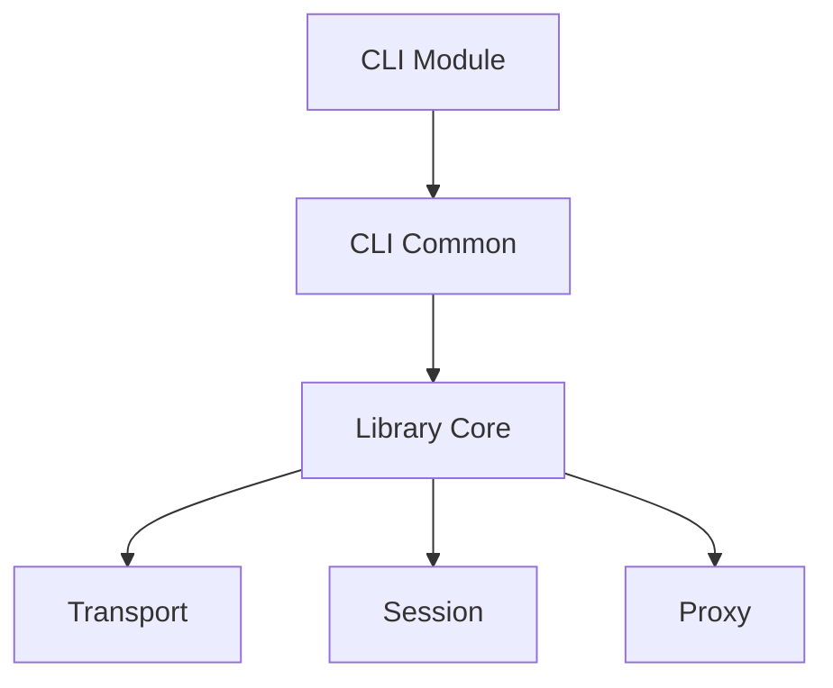

# Module Boundaries Assessment

## Overview

This document assesses the module separation between CLI and library functionality in the Shadowcat refactor, examining boundaries, dependencies, and encapsulation.

## Module Organization

### CLI Layer (`src/cli/`)
```
Purpose: Command-line interface implementation
Responsibilities:
- Argument parsing
- Command execution orchestration
- User interaction
- Output formatting
```

### Library Layer (`src/`)
```
Purpose: Core functionality
Responsibilities:
- Transport implementations
- Proxy logic
- Session management
- Protocol handling
```

## Boundary Analysis

### Well-Defined Boundaries

1. **Transport Abstraction**
   - CLI uses Transport trait interface
   - Implementation details hidden from CLI
   - Clean async trait boundaries
   - Example: StdioTransport used via trait

2. **Session Management**
   - CLI creates managers via factory functions
   - Library owns lifecycle management
   - Clean Arc<SessionManager> interface
   - No CLI knowledge of internals

3. **Error Types**
   - Unified ShadowcatError type
   - CLI converts to exit codes
   - Library provides rich error context
   - Clean Result<T> propagation

### Boundary Violations

1. **ProxyConfig in CLI**
   - Duplicates library configuration logic
   - Should be in library with CLI builder
   - Creates maintenance burden

2. **Direct Transport Creation**
   ```rust
   // In forward.rs - violates abstraction
   let mut transport = StdioTransport::new(cmd);
   transport.connect().await?;
   ```
   Should use factory pattern from library

3. **Rate Limiter Configuration**
   - CLI directly manipulates RateLimitConfig
   - Should provide high-level interface
   - Too much implementation detail exposed

## Dependency Analysis

### Clean Dependencies



### Problematic Dependencies

1. **CLI → Internal Types**
   - Direct use of MessageEnvelope
   - Direct use of MessageContext
   - Should use builder patterns

2. **Configuration Coupling**
   - ProxyConfig knows SessionConfig structure
   - Should use library-provided builders
   - Creates version coupling

## Interface Design

### Good Interfaces

1. **Command Pattern**
   ```rust
   pub trait Command {
       async fn execute(self) -> Result<()>;
   }
   ```
   Clean, consistent, testable

2. **Transport Trait**
   - Well-abstracted async interface
   - Proper error handling
   - Good use of associated types

### Poor Interfaces

1. **Configuration Building**
   - No builder pattern for complex configs
   - Direct struct construction
   - Missing validation at boundaries

2. **Message Construction**
   - CLI builds protocol messages directly
   - Should use library helpers
   - Too much protocol knowledge in CLI

## Encapsulation Assessment

### Well Encapsulated

1. **Session Internals**
   - CLI only sees public interface
   - Proper use of Arc for sharing
   - Clean cleanup task abstraction

2. **Proxy Implementation**
   - Forward/Reverse proxy details hidden
   - CLI only provides configuration
   - Clean async execution

### Poorly Encapsulated

1. **Transport Details**
   - CLI knows about stdio specifics
   - Should abstract command spawning
   - Too much process management in CLI

2. **Rate Limiting Setup**
   - Exposes all tier configurations
   - Should provide presets
   - CLI shouldn't know about tiers

## Recommendations

### Immediate Actions

1. **Move ProxyConfig to Library**
   ```rust
   // In library
   pub mod config {
       pub struct ProxyConfigBuilder { ... }
       impl ProxyConfigBuilder {
           pub fn with_rate_limiting(mut self, rpm: u32) -> Self { ... }
       }
   }
   ```

2. **Abstract Transport Creation**
   ```rust
   // In library
   pub async fn create_stdio_transport(cmd: Vec<String>) -> Result<Box<dyn Transport>> {
       // Handle creation and connection
   }
   ```

3. **Simplify Rate Limiter Interface**
   ```rust
   // In library
   pub enum RateLimitPreset {
       Development,
       Production { rpm: u32 },
       Custom(RateLimitConfig),
   }
   ```

### Long-term Improvements

1. **Command Factory Pattern**
   - Library provides command builders
   - CLI only orchestrates
   - Better testability

2. **Configuration Schema**
   - Define configuration as data
   - Validate at compile time
   - Generate CLI args from schema

3. **Plugin Architecture**
   - Define plugin interfaces
   - Allow external command registration
   - Maintain clean boundaries

## Testing Implications

### Current State
- CLI tests require full library
- Cannot mock library components easily
- Integration tests only option

### With Proper Boundaries
- CLI testable with mocked interfaces
- Library testable independently
- Clear contract testing possible

## Conclusion

The module boundaries show significant improvement over the monolithic design, but several violations remain that prevent true library independence. The CLI still has too much knowledge of library internals, particularly around configuration and transport creation.

**Boundary Score: B-**

Good foundational separation with clear areas for improvement. The violations are fixable without major architectural changes, and the overall direction is correct.

## Priority Matrix

| Issue | Impact | Effort | Priority |
|-------|--------|--------|----------|
| ProxyConfig location | High | Low | P0 |
| Transport factory | High | Medium | P0 |
| Rate limiter interface | Medium | Low | P1 |
| Configuration builders | Medium | Medium | P1 |
| Message helpers | Low | Low | P2 |
| Plugin architecture | Low | High | P3 |